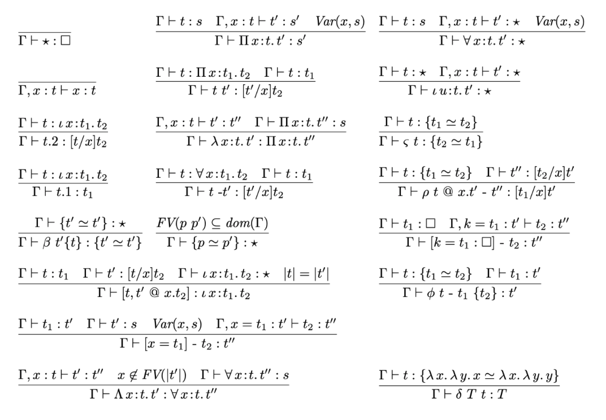

## Cedille-Core 

A minimal (1k LOC) programming language capable of proving theorems about its own terms.

## What that means?

There are big and small programming languages out there. C++ and Haskell are big languages. Other languages, such as [Brainfuck](https://en.wikipedia.org/wiki/Brainfuck), are so simple they could be implemented in [317 Python characters](https://codegolf.stackexchange.com/a/3085/7607). The [Lambda Calculus](https://en.wikipedia.org/wiki/Lambda_calculus) is popular for being a simple language that serves as the foundation of many functional programming languages.

Despite being turing-complete, there is one thing those languages can't do: expressing and proving mathematical theorems about its own terms. The few languages that can do that are rather big: [Idris](https://www.idris-lang.org/), [Agda](https://en.wikipedia.org/wiki/Agda_(programming_language)), [Coq](https://coq.inria.fr/) and [Isabelle](https://isabelle.in.tum.de/) are examples. Some languages like the [Calculus of Constructions](https://en.wikipedia.org/wiki/Calculus_of_constructions) (such as implemented on [Haskell-Morte-Library](https://github.com/Gabriel439/Haskell-Morte-Library)) are small and capable of expressing and proving mathematical theorems about its own terms, but, since their expressivity is very limited, they're not useful for proving useful properties about everyday programs and applications. Until recently, we had no language that was both small and featured practical theorem proving.

Cedille is a language developed by [Aaron Stump](http://homepage.divms.uiowa.edu/~astump/), aiming to solve that problem, among others. It is capable of proving useful theorems about its own terms, yet can be implemented in a very small amount of code. Cedille-Core is a compressed version of Cedille with less type inference and smaller code size.

## Syntax

name | syntax | description
--- | --- | ---
type of types | `Type` | the type of types
kind | `Kind` | the type of type of types
lambda | `[var : type] body` | a function
-lambda | `[var : type] body` | a computationally irrelevant function
forall | `{var : type} body` | the type of a function
-forall | `{var : type} body` | the type of a computationally irrelevant function
application | `(f x)` | application of lambda `f` to argument `x`
-application | `(f -x)` | application of lambda `f` to erased argument `x`
intersection | `<x : A> B` | type of a term `t` that has type `A` and `[t/x]B`
both | `@x B a b` | intersection of terms `a : A` and `b : B[a/x]`
first | `.a` | first, erased view of a dependent intersection
second | `+a` | second, full view of a dependent intersection
equality | `\|a = b\|` | proposition that terms `a` and `b` of possibly different types are equal
reflexivity | `$a b` | proof that `\|a = a\|`, erasing to `b`
symmetry | `~a` | if `a` proves `\|a = b\|`, then `a` proves `\|b = a\|`
rewrite | `%x A e a` | if `e` proves `\|x = y\|`, replaces `x` by `y` on the type `A` of term `a`
cast | `^e a b` | if `e` proves `\|a = b\|`, then cast term `b` to the type of term `a`
definition | `def x t u` | replaces ocurrences of `x` in `u` by `t`

## Technical specification

Please check the [specification repository](https://github.com/astump/cedille-core-spec).

